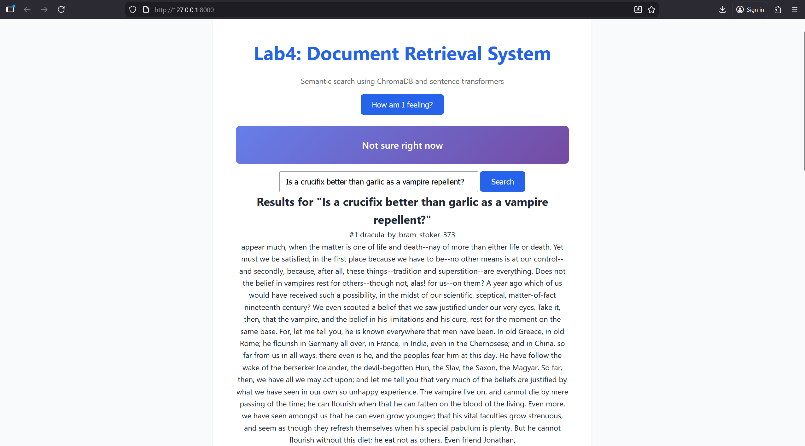

# Lab 4: Document Retrieval System with Chunking

Semantic search system using ChromaDB and sentence transformers featuring document chunking and PDF support for ARIN 5360.

## Quick Start

```bash
# Install dependencies
uv sync

# Start server
uv run uvicorn src.retrieval.main:app --reload
```

Server starts at http://localhost:8000

## Usage

### Via API

**Check health:**
```bash
curl http://localhost:8000/health
```

### Via Browser

Visit http://localhost:8000 (requires `static/index.html`).

### Testing
```bash
# Run all tests with coverage
uv run pytest
```

### Code Quality
```bash
# Check formatting
uv run ruff format --check

# Format code
uv run ruff format

# Lint
uv run ruff check
```

## Project Structure
```
lab4
├── documents
│   ├── dracula_by_bram_stroker.txt
│   ├── MSAI-courses.pdf
│   ├── sample1.txt
│   ├── sample2.txt
│   ├── sample3.txt
│   └── sample4.txt
│ 
├── images
│      └── Lab_4_Document_Retrieval.png
├── pyproject.toml
├── README.md
├── src
│   └── retrieval
│       ├── __init__.py
│       ├── embeddings.py
│       ├── loader.py
│       ├── main.py
│       ├── retriever.py
│       └── store.py
├── static
│   ├── index.html
│   └── style.css
├── tests
│   ├── data
│   │     ├── dracula_by_bram_stroker.txt
│   │     └── MSAI-courses.pdf
│   │      
│   ├── __init__.py
│   ├── test_chunking_template.py
│   ├── test_embeddings.py
│   ├── test_integration.py
│   ├── test_loader.py
│   ├── test_retriever.py
│   ├── test_smoke.py
│   └── test_store.py
└── uv.lock
```

## New Features

* Document chunking with configurable overlap
* PDF document ingestion using 'pypdf'
* Improved retrieval precision through chunk level indexing


## Architecture
* Loader:
  * Reads .txt and .pdf files from documents/
  * Supports optional document chunking
* Chunker:
  * Splits large documents into overlapping word based chunks
* Embedder:
  * Converts text to vectors using sentence-transformers
* Store: 
  * Manages ChromaDB collection for similarity search
* Retriever: 
  * Coordinates components for end-to-end retrieval
* API:
  * FastAPI endpoints for health checks and search


## Adding Documents
Place .txt files or .pdf files in the ```documents/``` directory and restart the server. Documents are indexed automatically at startup.

# Sample Output


